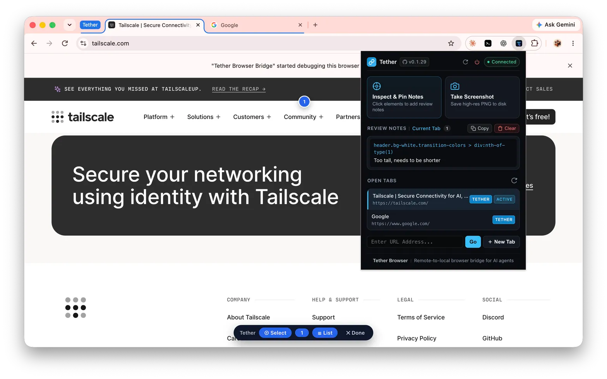
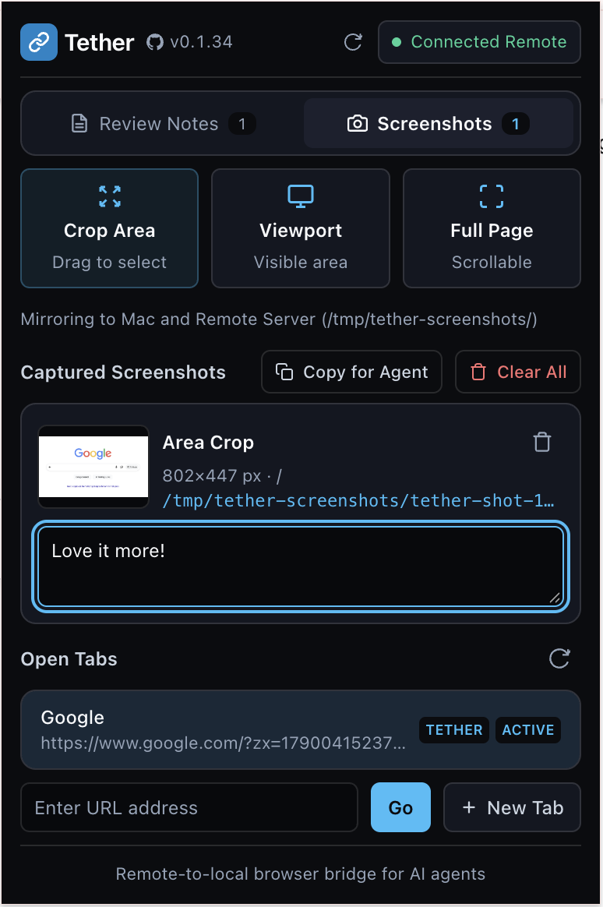

# tether-browser

Remote-to-local browser bridge for AI coding agents across Herdr, tmux, and SSH sessions.

No pixel streaming. No VNC. No cloud browser subscription.

<p align="center">
  
</p>

---

## 1. Why This Exists

Your coding agent runs on a remote Linux server. The browser it needs runs on your workstation.

A remote server cannot reach your Touch ID sensor, your password manager, or your phone passkey. Most sites an agent must drive require one of them to log in. Streaming the remote screen back to you costs 10 to 30 Mbps and adds 150 to 300 ms of delay.

Tether leaves Chrome on your workstation. Only commands and text cross the network. The agent runs `tether click @e2` on the server. Your local Chrome performs the click. You stay logged in, and every page renders on your own GPU.

The return path carries more than a result code. `tether snapshot -i` returns the page as text: every interactive element with its ARIA role, its accessible name, and an `@eN` reference to act on.

You can also point at what you see. Run `tether review start`, click any element in your own browser, and write a note. `tether review send` returns the CSS selector, the DOM path, the computed styles, the nearby text, and the framework source location, such as `components/Button.tsx:42:15`. The agent reads the screen you are reading, then edits the file that drew it. A source location is not guaranteed: the payload reports its provenance as `exact`, `inferred`, or `unavailable`, and Svelte supplies one only in development builds. Tether redacts password fields and values that look like tokens before anything leaves the page.

You do not need Tether if your agent runs on the same machine as your browser. Use local browser automation instead.

---

## 2. Quick Start

### Step 1: Install `tether` on your workstation (Mac or PC)

```bash
curl -fsSL https://raw.githubusercontent.com/jeffhuen/tether-browser/main/install.sh | bash
```
The installer automatically registers the Native Messaging Host for Chrome, Brave, and Edge.

Read the script before you run it. To inspect it first, run `curl -fsSL https://raw.githubusercontent.com/jeffhuen/tether-browser/main/install.sh -o install.sh`, read `install.sh`, then run `bash install.sh`.

### Step 2: Load the Extension in Chrome

1. Open `chrome://extensions` in Chrome, Brave, or Edge.
2. Toggle **Developer mode** on in the top-right corner.
3. Click **Load unpacked** and select the `packages/extension` folder from your repository clone.
4. The extension loads with deterministic ID `kaloekddddlgghmifoaapnhekggjcggn`.

### Step 3: Connect to your Remote Server

Run in your local terminal:
```bash
tether connect user@remote-server
```
Alternatively, click the **Tether extension icon** in your Chrome toolbar, enter `user@host`, and click **Connect**.

### Step 4: Install `tether` on your Remote Server

In your remote terminal (SSH session, Herdr pane, or cloud container):
```bash
curl -fsSL https://raw.githubusercontent.com/jeffhuen/tether-browser/main/install.sh | bash
```

The same advice applies here. Download and read `install.sh` before you run it.

### Step 5: Run Automation from your Remote Server

Run commands from your remote terminal:
```bash
# Open a URL in the Tether tab group
tether open https://example.com

# Inspect the interactive elements with @e1, @e2 references
tether snapshot -i

# Click elements and fill form fields
tether fill @e1 "user@example.com" && tether click @e2

# Capture a full-resolution Retina screenshot
tether screenshot output.png
```

### Browse using the remote server's network

The popup's **Remote** switch uses its connected SSH host. It becomes available only after Tether verifies SSH forwarding, not merely the browser bridge. Click **Remote**, then **Enable for this profile** to route web traffic through that host.

- HTTP, HTTPS, WebSockets, and destination DNS use SSH SOCKS forwarding. `localhost`, `127.0.0.1`, and `::1` refer to the remote host, on any port.
- This affects **all regular tabs in the Chrome profile**, not just the Tether group. Incognito is excluded. Chrome still renders locally and keeps its existing authentication and passkey support.
- Use a trusted development host. Localhost cookies and storage are shared across hosts; use a separate Chrome profile when you need isolation.
- If SSH drops, **Remote** stays on and new proxied requests fail. Open connection settings to reconnect to the same host, or turn **Remote** off. OFF restores your previous proxy settings even when the native helper is unavailable.
- Turn **Remote** off before switching hosts. Existing connections can keep their old route after a switch. Under connection settings, expand **Scope & recovery** to reload Tether tabs; reopen other affected tabs yourself.

This is a web proxy, not a VPN or a network sandbox. WebRTC and other non-web traffic are not covered. Browser policy, other proxy extensions, or disabling Tether can override or remove the proxy. It does not protect against other programs on your workstation taking over the proxy port after the native helper exits.

The extension rejects automation commands for browser and extension pages, including `about:blank`, which can inherit the extension's origin. Empty-page requests create a new `data:text/html,` tab. Use **New Tab** or `tether open ""` to recover from an old blank tab without closing existing tabs.

Update the local `tether` binary and reload the extension together; the extension now requires Chrome's `proxy` permission. SSH uses your local configuration and agent without interactive prompts. If connection setup fails, run `ssh user@host` in a terminal first to resolve authentication or host-key prompts.

For a terminal-created tunnel, connect to the same host in the popup. Tether reuses the reverse tunnel after a status check and leaves the terminal's SSH process alone when you disconnect from the popup. If that terminal exits, Tether establishes its own reverse tunnel.

---

## 3. How It Works: Remote-to-Local Bridge

`tether-browser` moves browser execution to the developer local machine where authenticators and sessions already live:

```text
┌────────────────────────────────────────────────────────┐           SSH Reverse Tunnel (-R 9333:localhost:9333)           ┌────────────────────────────────────────────────────────┐
│                      LOCAL MAC / PC                    │ ◄─────────────────────────────────────────────────────────────► │                     REMOTE SERVER                      │
│                                                        │                                                                 │                    (Linux / Cloud)                     │
│  ┌──────────────────────────────────────────────────┐  │   Control Channel: 127.0.0.1:9333                               │                                                        │
│  │   Active Chrome / Brave / Edge Window            │  │   App Tunnel: Origin-Preserving Proxy                           │  ┌──────────────────────────────────────────────────┐  │
│  │   • Native 120Hz Retina rendering                │  │                                                                 │  │   AI Coding Agent (Claude, Codex, OMP, Herdr)     │  │
│  │   • Touch ID, Passkeys, 1Password autofill       │  │                                                                 │  │                                                  │  │
│  │   • Dedicated "Tether" Tab Group                 │  │                                                                 │  │   $ tether tabs                                  │  │
│  │   • In-Page Review Inspector & Pins              │  │                                                                 │  │   $ tether snapshot -i                           │  │
│  └────────────────────────▲─────────────────────────┘  │                                                                 │  │   $ tether click @e14                            │  │
│                           │ Chrome Debugger & Tabs     │                                                                 │  │   $ tether fill @e2 "alice"                      │  │
│  ┌────────────────────────┴─────────────────────────┐  │                                                                 │  └──────────────────────────┬───────────────────────┘  │
│  │   Tether Extension (Manifest V3)                 │  │                                                                 │                             │                          │
│  │   • Dedicated popup menu with recent hosts       │  │                                                                 │                             │                          │
│  │   • chrome.tabGroups, chrome.debugger            │  │                                                                 │                             │                          │
│  └────────────────────────▲─────────────────────────┘  │                                                                 │                             │                          │
│                           │ Native Messaging (stdio)   │                                                                 │                             │                          │
│  ┌────────────────────────┴─────────────────────────┐  │                                                                 │                             │                          │
│  │   tether native-host                             │  │                                                                 │                             │                          │
│  │   • Unix domain socket: bridge.sock              │  │        JSON Commands (~200 bytes)                               │                             │                          │
│  └────────────────────────▲─────────────────────────┘  │ ◄───────────────────────────────────────────────────────────────┤  ┌──────────────────────────▼───────────────────────┐  │
│                           │ Unix Socket IPC            │                                                                 │  │   tether CLI                                     │  │
│  ┌────────────────────────┴─────────────────────────┐  │                                                                 │  │   • agent-browser syntax                         │  │
│  │   tether daemon                                  │  │ ├───────────────────────────────────────────────────────────────►  │   • Multi-tab routing (--tab <id>)              │  │
│  │   • Sole owner of TCP port 9333                  │  │        DOM Accessibility Snapshots & Review Reports             │  │   • Background session broker                    │  │
│  │   • Mode A forward proxy                         │  │                                                                 │  └──────────────────────────────────────────────────┘  │
│  └──────────────────────────────────────────────────┘  │                                                                 │                                                        │
└────────────────────────────────────────────────────────┘                                                                 └────────────────────────────────────────────────────────┘
```

1. **Client execution**: Google Chrome runs on your workstation. Passwords, session cookies, Touch ID, and 1Password autofill execute locally.
2. **Reverse SSH tunnel**: An SSH tunnel (`-R 9333:localhost:9333`) forwards commands from the remote coding agent to your workstation. No open firewall ports required.
3. **Commands over wire**: The remote agent sends 200-byte JSON requests (`browser.open`, `browser.snapshot`, `browser.click`).
4. **Structured results**: The client returns compact 20 KB accessibility trees with `@eN` references. No video bandwidth consumed; zero input lag.

---

## 4. The Limits of Streaming Graphics and Pixel Data

Pixel streaming fails on a remote link for three reasons. It consumes 10 to 30 Mbps. It adds 150 to 300 ms of round-trip delay. Packet loss and bitrate limits blur small fonts and form fields.

### The Command-Over-Wire Alternative

Tether does not stream pixels or video frames. It sends lightweight ~200-byte JSON commands (`click`, `fill`, `open`) and returns structured ~20 KB accessibility trees:

| Metric | Remote Pixel Streaming (VNC, Video, Sixel) | Tether Browser Bridge |
|---|---|---|
| **Bandwidth** | 10 to 30 Mbps continuous video | ~200 bytes per command (~0 MB/s) |
| **Input Lag** | 150 to 300 ms video round-trip delay | 0 ms (renders on your local GPU at 120Hz) |
| **Cellular Hotspot Support** | No (drains data caps, stutters on packet loss) | Yes (minimal packet size, immune to jitter) |
| **Authentication** | Fails (remote server has no biometric hardware) | Native (uses your laptop Touch ID and 1Password) |
| **Server RAM Usage** | 500 MB to 2 GB per browser instance | 0 MB (browser runs on your laptop) |

---

## 5. Primary Use Cases

* **Cloud devboxes and remote agents**: Equip headless agents on AWS, Hetzner, GCP, or dev containers with full browser automation without configuring X11, VNC, or cloud browser subscriptions.
* **Cellular and travel workflows**: Run browser automation over high-latency cellular connections, train Wi-Fi, or mobile hotspots without video bandwidth degradation.
* **Protected enterprise portals**: Let coding agents test and interact with portals behind corporate SSO, Passkeys, YubiKeys, and hardware two-factor authentication.
* **UI and layout verification**: Let remote agents capture full-resolution Retina screenshots and test web forms in your real browser without modifying personal tabs.

---
## 6. Multi-Tab Management and Tab Groups

Tether organizes automated tabs in a blue **Tether** tab group in your browser:

* **Live Tab Discovery**: `tether tabs` queries the browser in real time to show all open tabs, titles, URLs, and active target:
  ```text
  Open Tabs (2):
   * [1] "Application Dashboard"
         URL: https://app.example.com/dashboard
         ID:  101
     [2] "Overview Dashboard"
         URL: https://app.example.com/overview
         ID:  102
  ```
* **Switch Active Tab**:
  ```bash
  tether switch <tabId>
  ```
* **Direct Tab Targeting**: Run any command against a specific tab without changing active view:
  ```bash
  tether snapshot --tab <tabId> -i
  tether click --tab <tabId> @e3
  tether eval --tab <tabId> "document.title"
  ```

---

## 7. Developer Visual Feedback

To capture visual feedback on a page, click **Inspect & Pin Notes** in the Tether popup. Pin notes on elements, then click **Copy** to paste structured component context into your agent prompt.

Use **Review Notes** and **Screenshots** to switch tools. When either tab has keyboard focus, use the arrow keys to switch tabs. Click a screenshot thumbnail to open its preview, and press **Escape** to close it.

The popup remembers your last **Review Notes** or **Screenshots** selection, including after restarting Chrome.

Choose **Crop Area**, then drag a rectangle on the page. Release to capture, or press **Escape** to cancel. For keyboard selection, use arrow keys to move, **Shift + arrow keys** to resize, and **Enter** to capture. **Viewport** captures the visible page. **Full Page** captures the entire document, including horizontal overflow.

After saving a note or an area capture, the popup reopens on **Review Notes** or **Screenshots**, respectively. Cancelling leaves it closed. If you switch tabs or windows before the save finishes, Tether does not take focus. The extension requires Chrome 127 or later.

Screenshots default to lossless PNG at one image pixel per CSS pixel. Retina displays and page zoom do not increase the output density. Chrome scales the capture before encoding it. Tether does not change the page's zoom or layout.

Screenshot previews use Chrome's `unlimitedStorage` permission because the gallery can exceed the [default 10 MB storage quota](https://developer.chrome.com/docs/extensions/reference/api/storage#storage-areas). Reload the unpacked extension after updating its manifest to apply this permission.

After updating the extension, refresh pages that already have a Tether review overlay before using the updated capture controls.

<p align="center">
  
</p>
---

## 8. Interoperability with `agent-browser`

`tether` and `agent-browser` complement each other:

* **Use `tether`** for everyday browser automation, interactive workflows, and sites requiring Passkeys, 2FA, or Touch ID in your personal Chrome browser.
* **Use `agent-browser`** when your workflow requires specialized tools not in Tether, such as automated accessibility audits (`agent-browser a11y`), network request mocking (`agent-browser network`), or React Suspense profiling (`agent-browser react`).

### Network Latency Comparison (50ms SSH / 100ms RTT)

| Protocol | Action Execution | Round-Trips over SSH | Wire Latency |
|---|---|:---:|:---:|
| **Raw CDP (`agent-browser`)** | Remote agent issues 5 sequential CDP calls across the tunnel:<br>1. `DOM.resolveNode`<br>2. `DOM.getBoxModel`<br>3. `Input.dispatchMouseEvent` (move)<br>4. `Input.dispatchMouseEvent` (down)<br>5. `Input.dispatchMouseEvent` (up) | **5 RTTs** | **~500 ms** |
| **Tether RPC (`tether`)** | Remote agent sends **one** JSON request:<br>`{"method":"browser.click","params":{"ref":"@e1"}}`<br>All coordinate resolution and mouse events execute **locally on your client loopback at 0ms**. | **1 RTT** | **~100 ms** |

### Connecting Both

Forward Chrome's CDP port alongside Tether (`ssh -R 9333:localhost:9333 -R 9222:localhost:9222 user@server`) to run `agent-browser --cdp 9222` directly against Chrome whenever specialized devtools are needed.

---

## 9. Architecture and Security Invariants

1. **Single TCP Port Owner**: `tether daemon` is the exclusive owner of TCP port `127.0.0.1:9333`.
2. **Private Unix Domain Socket**: `tether native-host` communicates over a user-scoped Unix socket (`/tmp/tether-<uid>/bridge.sock`, mode `0700` directory, `0600` socket) with stale-probe unlinking.
3. **No Unrequested Browser Spawning**: If the Chrome extension is connected, Tether operates through official extension APIs (`chrome.debugger`, `chrome.tabGroups`). Subprocess Chrome is reserved strictly as an offline fallback.
4. **Focus Emulation**: The extension calls `Emulation.setFocusEmulationEnabled({ enabled: true })`, ensuring synthesized clicks and keyboard inputs are processed by Chromium even on background or unselected tabs.

---

## 10. Package Layout

```text
tether-browser/
├── cmd/
│   └── tether/               # Main CLI entrypoint (connect, daemon, extension, native-host)
├── packages/
│   ├── protocol/             # JSON-RPC schemas, action types, review report formatting
│   ├── client/               # Native host bridge, extension driver, CDP driver, proxy
│   ├── cli/                  # Remote agent CLI, terminal formatting, broker client
│   └── extension/            # Manifest V3 extension (popup UI, tab groups, review overlay)
└── install.sh                # Universal one-line installer
```

---

*Tether Browser | Remote-to-local browser bridge for AI agents*
